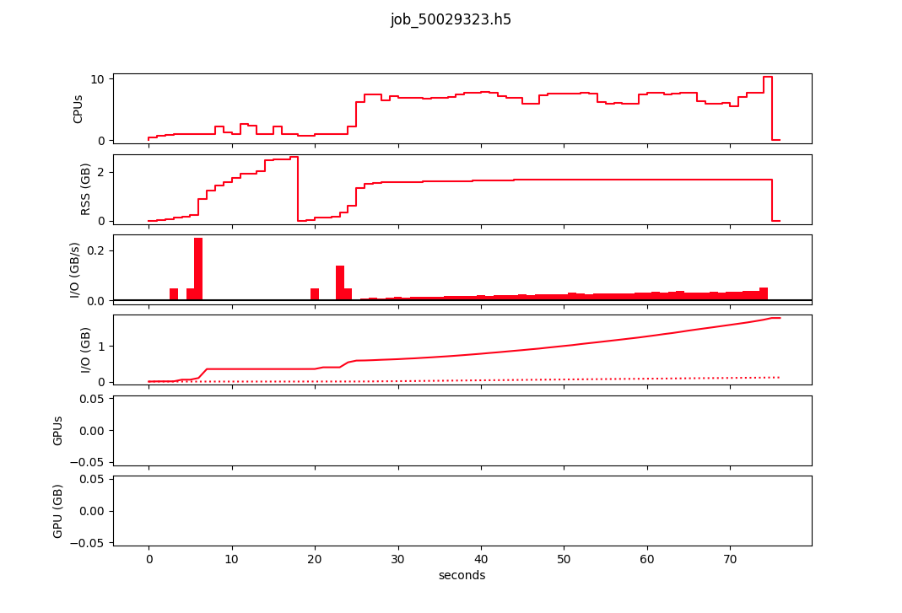
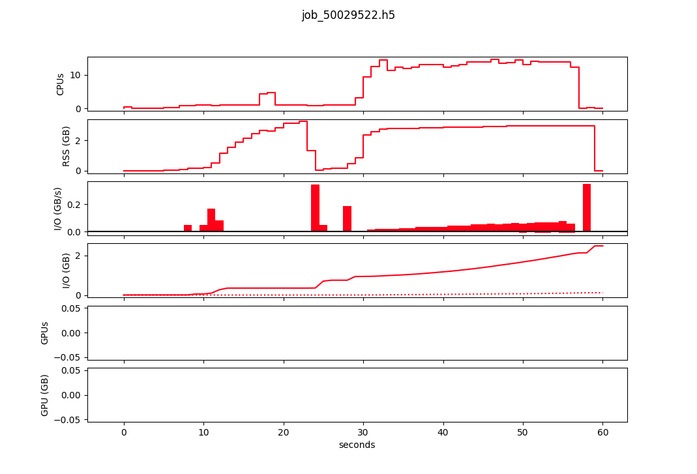

## Runtime (seconds) for cpus  4 - 32

<center>

</center>

<details>
<summary>Data and R script to generate plots</summary>

```bash
cpus,Mahuika,eRI
4C,132,125
8C,76,76
12C,63,62
16C,61,60
20C,52,58
24C,56,54
```
```r
# Load required libraries
library(ggplot2)
library(gghighlight)
library(readr)
library(tidyr)
library(dplyr)

# Read the CSV file
data <- read_csv("erivsmahuika.csv")

# Print column names to verify
print(colnames(data))

# Clean the cpus column by removing non-numeric characters
if("cpus" %in% colnames(data)) {
  data$cpus <- gsub("[^0-9.]", "", data$cpus)
  data$cpus <- as.numeric(data$cpus)
  
  # Check for any remaining NAs
  if(any(is.na(data$cpus))) {
    print("Warning: Some entries in the 'cpus' column could not be converted to numeric and are set to NA.")
  }
} else {
  stop("The 'cpus' column does not exist in the data")
}

# Reshape the data from wide to long format
data_long <- pivot_longer(data, cols = c(Mahuika, eRI), names_to = "Cluster", values_to = "Runtime")


# Filter out Inf and NA values before plotting
data_long <- data_long %>%
  filter(!is.infinite(Runtime) & !is.na(Runtime))

# Create the line chart
ggplot(data_long, aes(x = cpus, y = Runtime, color = Cluster)) +
  geom_line() +
  geom_point(size = 3) +
  gghighlight() +
  scale_color_manual(values = c("Mahuika" = "blue", "eRI" = "red")) +
  scale_x_continuous(breaks = c(4,8,12,16,20,24,28,32)) +
  scale_y_continuous(breaks = seq(0, max(data_long$Runtime), by = 10)) +
  labs(title = "Runtime (seconds) for 13223_Ahuriri_7a1",
       x = "Number of CPUs  ( --cpus-per-task)",
       y = "Runtime (seconds)") +
  theme_minimal() +
  theme(legend.position = "bottom",
        panel.background = element_rect(fill = "gray95", color = NA),
        plot.background = element_rect(fill = "white", color = NA))
```
</details>

<br>

## Slurm Profiling

<center>






</center>