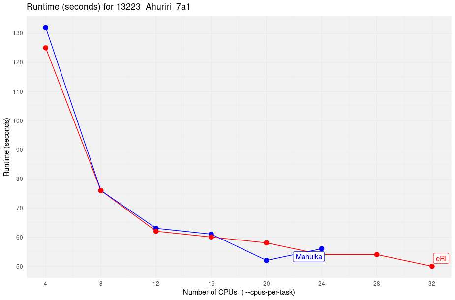
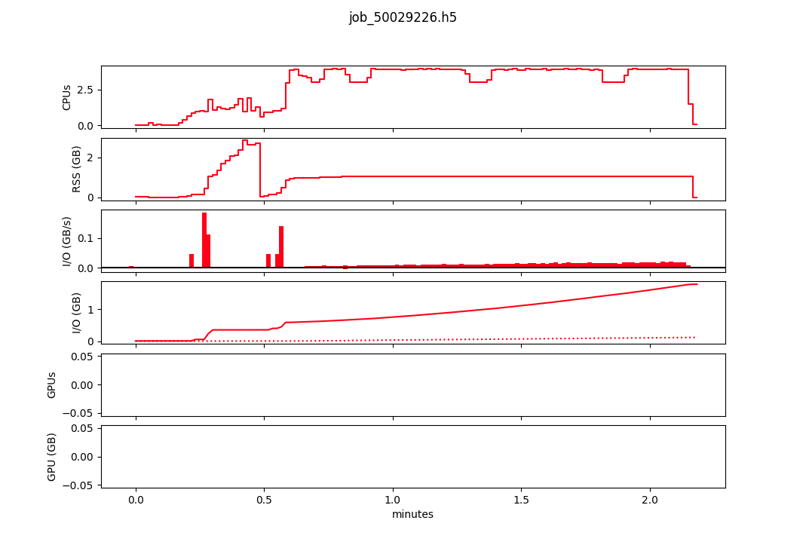
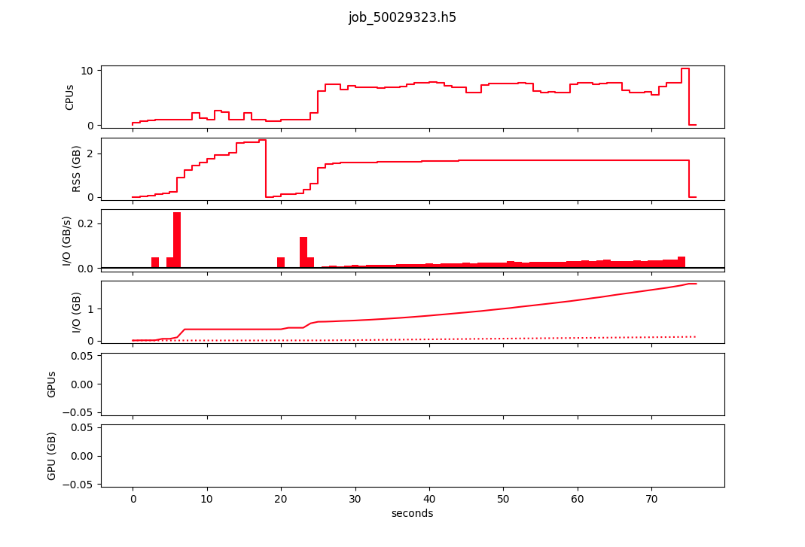
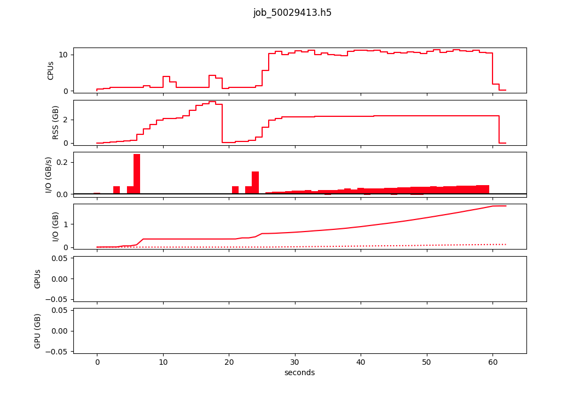
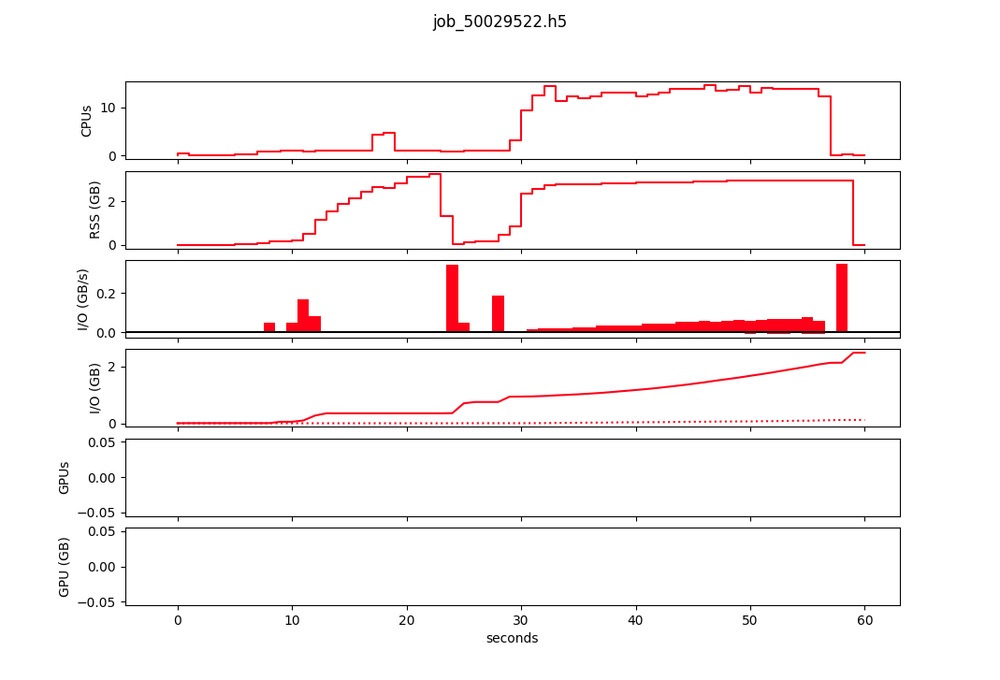
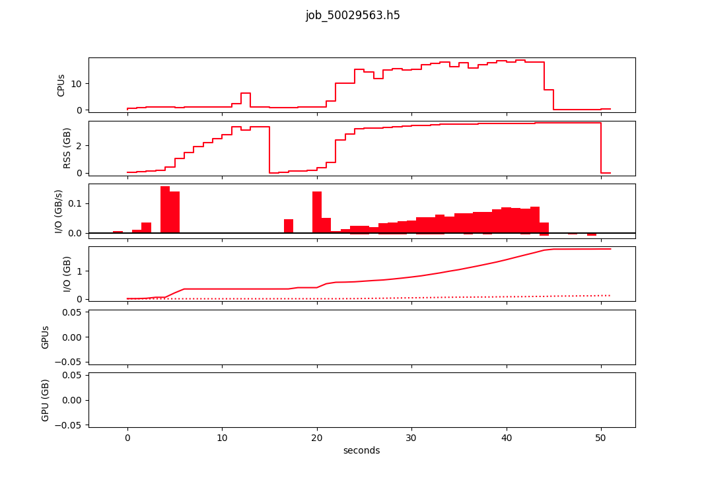
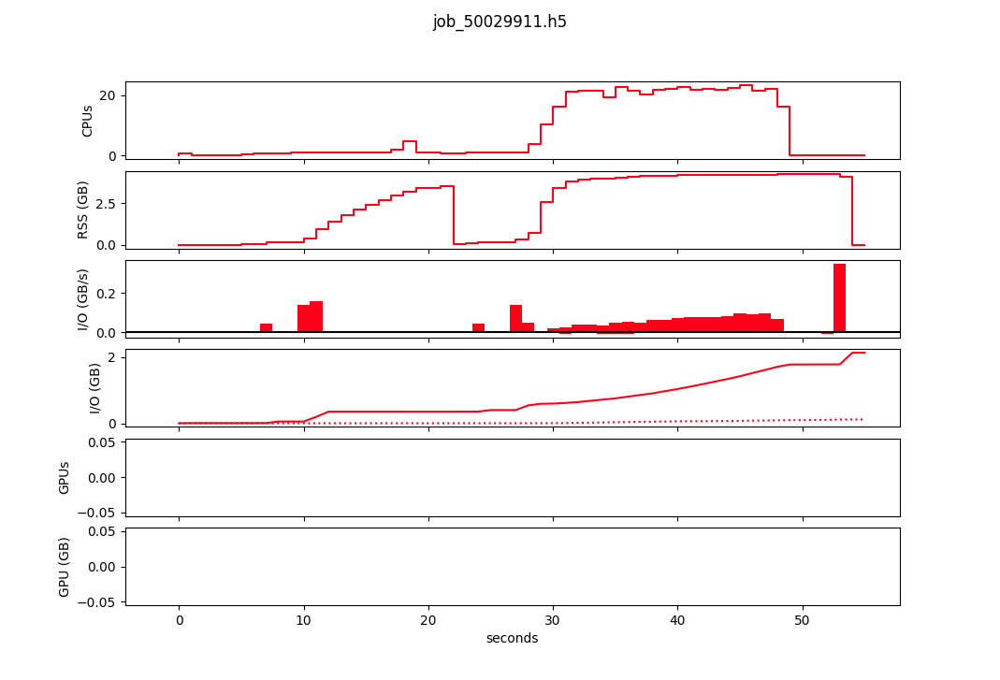

# Runtime data

<small> Runtime for  one sample across varying number of CPUs: This is for the second phase of the workflow which creates the .db files from .apxims files (`08-snakemake/Snakefile_2`) </small>

## Runtime behaviour

??? hourglass "4cpu"
    

??? hourglass "8cpu"
    

??? hourglass "12cpu"
    

??? hourglass "16cpu"
    

??? hourglass "20cpu"
    

??? hourglass "24cpu"
    
