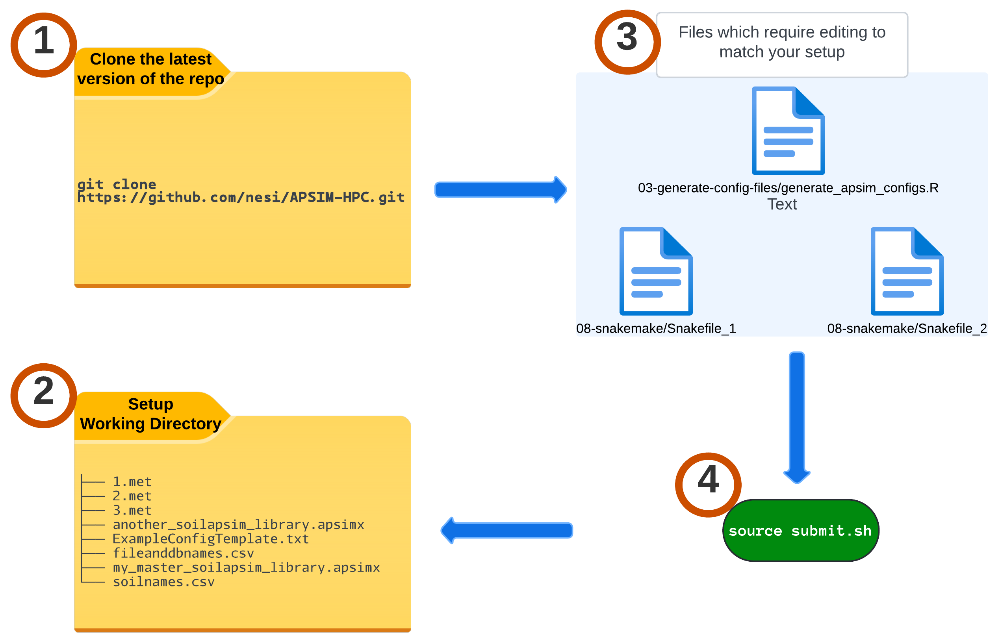

<center>
# APSIM-HPC
</center>

Deploy APSIM (Agricultural Production Systems sIMulator - https://www.apsim.info/) on high performance computing clusters.

<center>

</center>

## 1. Apptainer build


!!! terminal-2 "Building the APSIM container"

    ```bash
    git clone https://github.com/nesi/APSIM-HPC.git
    cd APSIM-HPC/01-apptainer-build
    ./updateversion-and-build.sh
    ```
    ??? video "`./updateversion-and-build.sh`"

        <video width="100%" controls>
          <source src="https://github.com/user-attachments/assets/a342fcd4-55e9-4615-896b-7eac46368e84" type="video/mp4">
          Your browser does not support the video tag.
        </video>


<br>
!!! note ""

## 2. Setup the working directory 


!!! circle-info "Structure/Content of the working directory"

    APSIM requires Weather files ( .met), Template to create the config files, CSV files with soil,file,database names and soil library .apsimx files to be on the same working directory.

    ```bash
    ├── 1.met
    ├── 2.met
    ├── 3.met
    ├── another_soilapsim_library.apsimx
    ├── ExampleConfigTemplate.txt
    ├── my_master_soilapsim_library.apsimx
    └── soilnames.csv
    ```
<br>
!!! note ""

## 3. Update Workflow files for current simulation

!!! quote ""
    Please make sure to edit the files within the cloned repository without changing the repository directory structure or filenames. Final submission script relies on the existing structure and names to populate the working directory with runtime scripts.


### `03-generate-config-files/generate_apsim_configs.R` 

* This script generates the config.txt files ( one file per soil sample per weather file)
* It will be executed interactively than submitting as a job to scheduler ( relatively quick -  generating 10,000 files will be done within 75 seconds or so)
* Last step of this script is to "split" those config files to multiple **Sets** (Default is 3 **Sets**)
    - What is the purpose of this **split** ?
        - This a pre-configuration for `08-snakemake/Snakefile_1` step. Latter process the config files and create the corresponding .apsimx files ( plus the .db placeholder files). It can not be done in parallel due to https://github.com/nesi/APSIM-HPC/issues/31. 
        - Since the processing time per file is ~25 seconds, having all of the configfiles ( assuming there are thousands to process) in one single directory will add unreasonable runtimes. Safest ( and the easiest) solution is to split those files to multiple **Sets** ( processing within a set is still serial but it will be quicker as it will be a fraction of the total samples). [We have prepared a calculator](https://nesi.github.io/APSIM-HPC/3-runtime-and-set-calculator/) which will provide you an estimate on how many **Sets** each experiment will need to keep the processing  of Configfiles under 24hours **per Set**


!!! r-project "update `03-generate-config-files/generate_apsim_configs.R`"

    First file to be edited is `03-generate-config-files/generate_apsim_configs.R` which will be used to generate the config.txt files

    * Review line number 6, 8 and 11 

    ```r
    6 SoilNames <- as.vector(unlist(read.csv("soilnames.csv"))) ##List of soil names that must exist in the Soil Library .apsimx file (most likely supplied by experienced APSIM user)

    8 ConfigTemplate <- "ExampleConfigTemplate.txt" ##Base config file

    11 SoilLibrary <- "my_master_soilapsim_library.apsimx" ###Change name to the soil library you are using
    ```
    
    * if you would like to change the number of **Sets** from default `3`, change the value of `nSets` on line 87

    ```r
    87 SplitConfigFilesIntoSets(list.files(pattern = "ConfigFile.txt$"), nSets = 3)
    ```
### `08-snakemake/Snakefile_1`

* This step is scheduler based. It generates the .apsimx ( and placeholder .db files) from config files
* This is a serial process  ( as described above) which makes it the longest step in terms of runtime in the workflow ( take ~25 seconds per config file)
* Default runtime assigned to this step is **16 hours** ( this is sufficient to handle a set of 2300 files)

!!! snake "update `08-snakemake/Snakefile_1`"

    * All major changes are within the `config` block
        - `apptainer_bind` - We recommend binding the full filesystem. 
            - For **eRI**, It will be `"apptainer_bind": "/agr/scratch,/agr/persist"`
            - For **Mahuika**, it's `"apptainer_bind": "/nesi/project,/nesi/nobackup,/opt/nesi"`
        - `"excluded_txt_files"` is the name of the template config which will excluded during the processing. Otherwise, it will create a .apsimx and a place holder .db file for itself

    ```bash
       4 config = {
       5     "apptainer_bind": "/full/filesystem",
       6     "apptainer_image": "/path/to/container/image/version.aimg",
       7     "excluded_txt_files": ["ExampleConfigTemplate.txt"],
       8     "max_consecutive_failures": 10,
       9     "slurm_logdir": "slurmlogs"
      10 }
    ```

    * If you would like to increase the runtime, refer to **line 28** 

    ```bash
      28         time = "16:00:00"
    ```
### `08-snakemake/Snakefile_2`

* This step is scheduler based. It generates the .db from .apsimx files
* Processing will be done in parallel .i.e. Each .apsimx file will have it's own job. Average processing time per file at 12 cpus varies between 50 seconds to 5 minutes. We have set the default to be 10 minutes per file. Similar to above, change the `time = ` varibale as needed.

!!! snake "update `08-snakemake/Snakefile_2`"

    * Simlar to above, all changes are within the `config` block
        - `"excluded_apsimx_files"` is/are the name/s of the soil library .apsimx files which will excluded during the processing. Otherwise, it will create a .db file/s for those


    ```bash
       5 config = {
       6     "apptainer_bind": "/full/filesystem",
       7     "apptainer_image": "/path/to/container/image/version.aimg",
       8     "excluded_apsimx_files": ["my_master_soilapsim_library.apsimx", "another_soilapsim_library.apsimx"],
       9     "slurm_logdir": "slurmlogs",
      10     "size_threshold": 1 * 1024 * 1024  # 1MB in bytes
      11 }
    ```

### `submit.sh` on the parent directory

Update line 28 on `submit.sh` file with the path to above working directory with .met, .apsimx,etc 

```bash
# assign the workng directory
export working_dir="/path/to/working/directory"
```

<br>
!!! note ""

## 4. Submit the workflow to Scheduler

!!! bulb "Assumptions and pre-requisites"

    1. Cloned the latest version of the repo (https://github.com/nesi/APSIM-HPC.git)
    2. `03-generate-config-files/generate_apsim_configs.R` , `08-snakemake/Snakefile_1` and `08-snakemake/Snakefile_2` were updated with names of the template files,etc. 
    3. Filenames and directory structure of the **cloned repo** **were/was not** altered.
        - submission script relies on the relative paths and names as it is within the Github repo.
        - If you are to change paths or names, make sure to review `submit.sh` and amend to reflect the changes.  

    
!!! rocket "Launch it with the command `source submit.sh`"

    What does it do : 
    
    <center>{width="500"}</center>

    <br>
    ??? video "`source submit.sh`"

        <video width="100%" controls>
          <source src="https://github.com/user-attachments/assets/be6820fa-93ff-485e-b786-b826046e8e08" type="video/mp4">
          Your browser does not support the video tag.
        </video>

        

    ??? clipboard-question "Reason for using `source` and not `bash`"

        - This is do with `cd /working/directory` command within the `submit.sh` script

        - When you run a script using `bash script.sh`, the script is executed in a new subshell. This means:
            - A new shell process is created to run the script.
            - Any changes to the working directory (`cd` commands) only affect this subshell.
            - Once the script finishes, the subshell terminates, and you return to your original shell with its original working directory unchanged.
            
